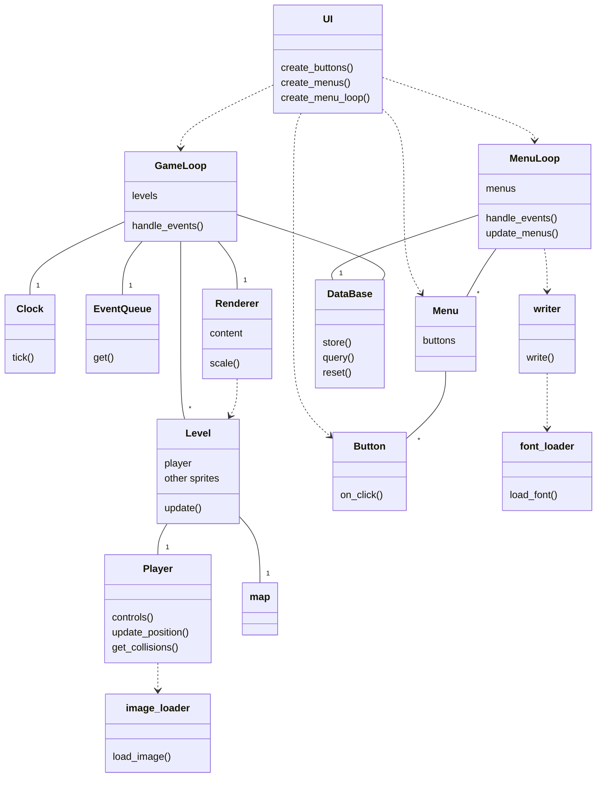
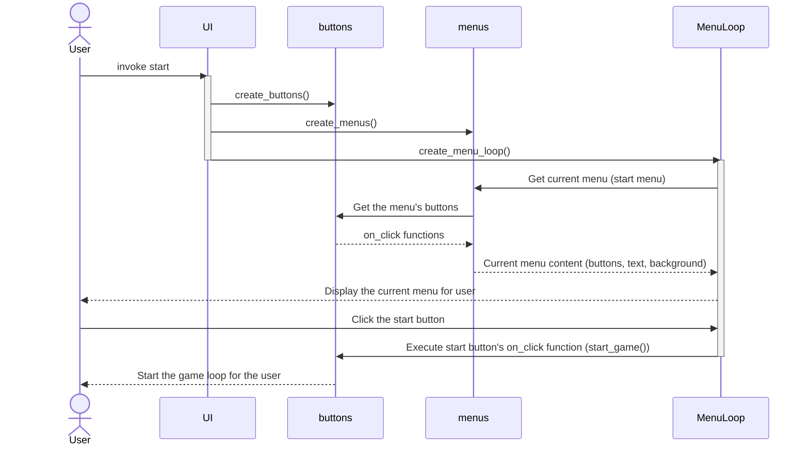
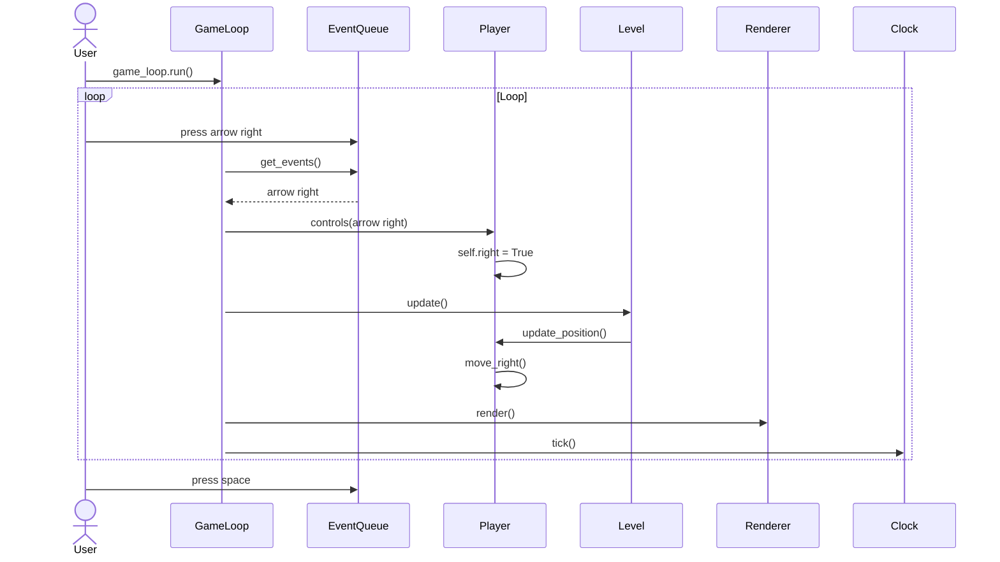

# Architecture description

## Project structure
### Package diagram
This diagram is here to provide a rough overview of the project structure:

The most important packages here are the game package and the ui package. The **ui** package hosts the code related to the graphical user interface while the **game** package hosts all the code that makes the game itself happen. Both these packages use the **DataBase** class - the game uses it to store information, and the ui queries and displays its contents. Both the game and ui also depend on the **loaders** package. This package provides means to access files in the assets folder. For the ui this means loading fonts to display text, and the game itself of course needs a way to load images to implement the visuals.

### File structure
Here's a closer look at how the project's files are structured:

The goal here is to follow the single repository principle. All classes are in their own files, and the files should have a clear purpose. On a package-level all the files that go into a package should make sense as components of said package.

Another goal of the project is to be as extensible as possible. This means that rather than being locked to represent a single thing, many of the classes are implemeted with the intention that many instances will be generated using them. For example, instead of every level in the game being its own class, there is just one Level class. By using that class with different parameters any number of levels can be generated with minimal amount of new code.  

See below for a more in-depth look at the classes and their relationships.

## The most important classes and their relationships in a class diagram
This diagram is not exhaustive - instead of depicting every nuance, it focuses on providing an understandable overview.

## Class descriptions
The classes that are most important to the logic and architecture of the game are described in more detail here.

### Game component classes
#### Player
This class hosts everything directly related to the player, most importantly the logic related to player movement and controls. The player class provides methods for controlling the player movement utilizing pygame events, for updating the player position and for checking for collisions with the game map.

#### Level
The game levels are generated with the level class. The level class is most importantly responsible for providing a sprite group with all the sprites of the current level and an update function to keep track of the level's state. A level has a player, and the player is just one of the sprites a level has, just like the map tiles.

A key point is that the level class does not represent any single level. Rather it is implemented with the goal that creating any number of levels using the class is effortless.

#### Renderer
The renderer class renders content to the screen. A renderer takes a level as content to render, scales it from a small drawing surface to the full-sized display and draws the scaled surface onto the screen.
  - This scaling is what makes the pixelated look of the game happen
  - Menus do not have a separate renderer as native resolution is used there

#### GameLoop
A GameLoop takes a list of levels, a renderer, and a database. The loop checks for events, updates the level and stores game results using the database.

Note that the GameLoop class is implemented to support any number of levels. Thus, extending the game with more levels requires minimal effort.

#### DataBase
The DataBase class provides the database funcionalities to the game and UI. This means functions for storing and querying data.
- Every time a game loop ends, the level to which the player got gets saved
- The UI queries the database to display stats
  - The database can be queried for the total amount of tries and the highscore (highest level passed)
- The UI also provides a button for resetting the database
 
### UI classes
#### Button
Buttons are what makes the UI usable.
- A button consists of text, a rect and a reference to a on_click function
- When the user clicks the button the function gets executed
- Any function can be assigned: for example starting a new game, giving an exit call or providing a dict key to navigate to a new menu window are all implemented as on_click functions

Much like the Level class, the Button class is a way to generate all the buttons in the game, not represent a single button.

#### Menu
The most important functionality of a menu is to host buttons. In addition to a list of buttons, the Menu class also takes text that gets displayed when the user views the menu.

Any number of menus can be generated with the Menu class.

#### MenuLoop
A MenuLoop takes a dict of menus and a database. The loop checks for clicks on the buttons of the menus, handles navigation between menus and updates the menus. It also and queries the database to display its contents / resets it when needed.

The MenuLoop can hold any number of menus in a dictionary. The menus are stored in a dictionary instead of a list to make navigating between menus easier. In practice adding new menu-to-menu navigation can be done as easily as: 1. creating a button with an on_click function that returns the dict key of the menu you want the button to send the user to, and 2. assigining said button to another menu that you want to have access to the first menu.    

#### UI
The sole purpose of the UI class is to construct the UI (MenuLoop and the buttons are where the actual functionality of the UI is). In practice this means that it first creates all the needed buttons, then creates the menus (and assigns the buttons for the menus) and, finally, creates the menu loop with the menus. The UI class also takes a reference to the GameLoop to provide an on_click function to start the game.

The UI creation is in its own class for two reasons: To keep the code clean, and, most importantly, to make extending the UI easy. All the UI components are generated in this file, so, if you for example want to make a new menu with new buttons, this is often the only place you need to make changes in.

### A sidenote: What's a Sprite and what's not
I had much trouble deciding what should and shouldn't be implemented with sprites. Heres my approach:
- All in-game stuff is sprites
  - Makes especially the drawing to the screen part easier
- UI does not utilize sprites
  - Writing text on sprites gets unecessarily complex fast
  - Scaling sprites with text easily leads to unwanted pixelation
  - Using native resolution rects and text instead looks nicer and is easier to scale to any display size

## Sequence diagrams
### Starting the program and starting a new game

Starting the game starts the UI construction process. Once the buttons, menus and the menu loop are constructed, the menu loop starts and the user sees the start menu view. Starting the game sends the user to the game loop.

### Playing the game

