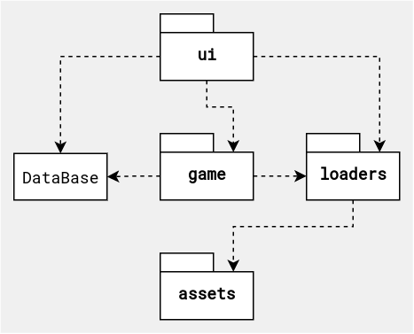
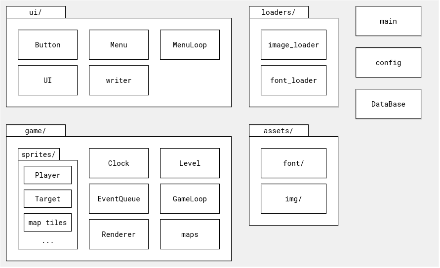
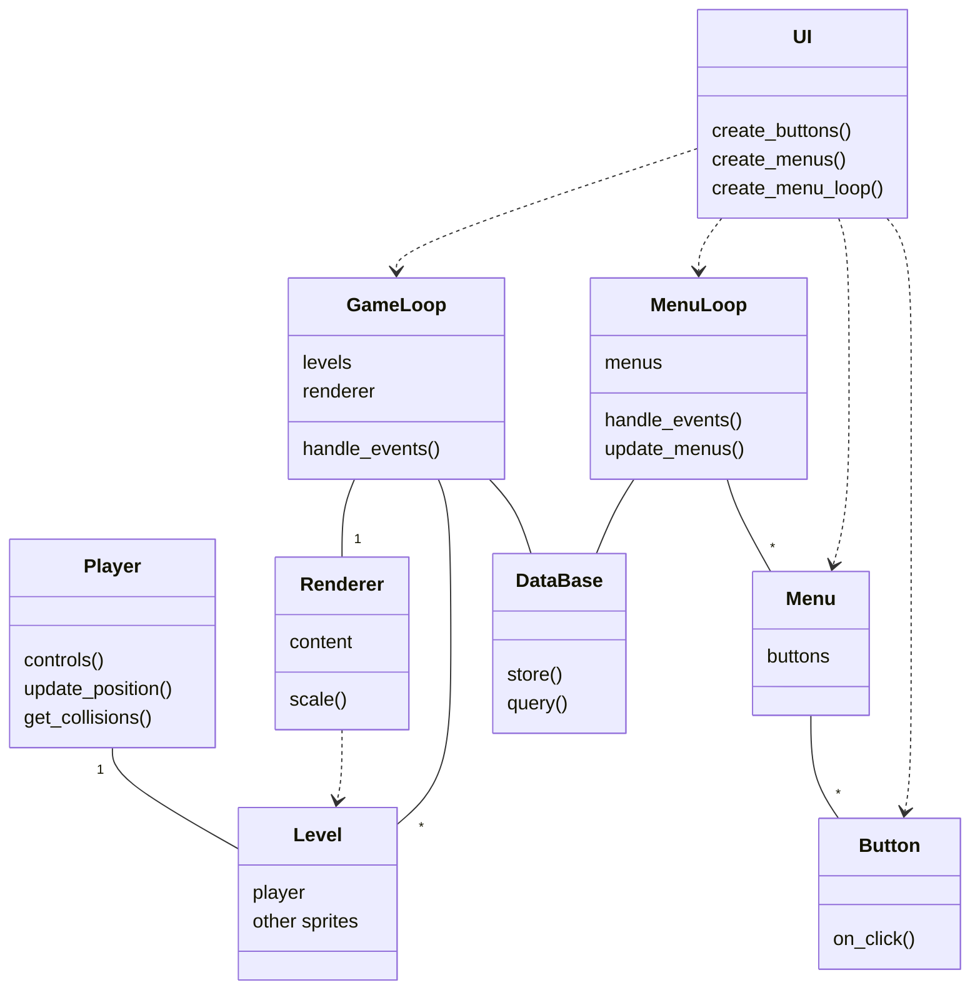
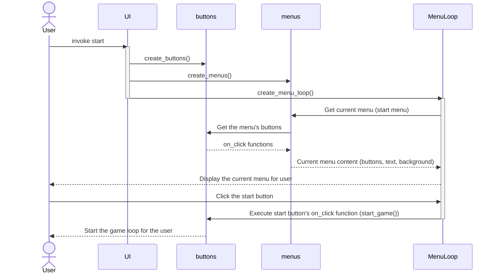

# Architecture description

## Project structure
### Package diagram
This diagram is here to provide a rough overview of the project structure:

The most important packages here are the game package and the ui package. The **ui** package hosts the code related to the graphical user interface while the **game** package hosts all the code that makes the game itself happen. Both these packages use the **DataBase** class - the game uses it to store information, and the ui queries and displays its contents. Both the game and ui also depend on the **loaders** package. This package provides means to access files in the assets folder. For the ui this means loading fonts to display text, and the game itself of course needs a way to load images to implement the visuals.

### File structure
See below for a more in-depth look at the file structure of the project

###

## The most important classes and their relationships in a class diagram
This diagram is not exhaustive - instead of depicting every single class, method and dependency, it focuses on providing an understandable overview of the most important ones.

## Class descriptions
### Game component classes
#### Player
This class hosts everything directly related to the player, most importantly the logic related to player movement and controls. In a nutshell the player class provides methods for controlling the player movement utilizing pygame events, for updating the player position and for checking for collisions with the game map.

#### Level
The game levels are generated with the level class. The level class is most importantly responsible for providing a sprite group with all the sprites of the game and an update function to keep track of the level's state. A level has a player, and the player is just one of the sprites a level has, just like the map tiles.

#### Renderer
The renderer class renders content to the screen. A renderer takes a level as content to render, scales it from a small drawing surface to the full-sized display and draws it onto the screen.
  - This scaling is what makes the pixelated look of the game happen
  - Menus do not have a separate renderer as native resolution is used there

#### GameLoop
A GameLoop takes a list of levels, a renderer, and a database. The loop checks for events, updates the level and stores game results using the database.

#### DataBase
The DataBase class provides the database funcionalities. Most importantly functions for storing and querying data.
- Every time a game loop ends, the level to which the player got gets saved
- The database can be queried for the total amount of tries and the highscore (highest level passed)
- The UI queries the database to display stats
 
### UI classes
#### Button
Buttons are what makes the UI usable.
- A button consists of text, a rect and a reference to a on_click function
- When the user clicks the button the function gets executed
- Any function can be assigned: for example starting a new game, giving an exit call or providing a dict key to navigate to a new menu window are all implemented as on_click functions

#### Menu
The most important functionality of a menu is to host buttons. In addition to a list of buttons, the Menu class also takes text that gets displayed when the user views the menu

#### MenuLoop
A MenuLoop takes a dict of menus and a database. The loop checks for clicks on the buttons of the menus, handles navigation between menus, updates the menus and queries the database to display its contents when needed.

#### UI
The sole purpose of the UI class is to construct the UI (MenuLoop and the buttons are where the actual functionality of the UI is). In practice this means that it first creates all the needed buttons, then creates the menus (and assigns the buttons for the menus) and, finally, creates the menu loop with the menus. The UI class also takes a reference to the GameLoop to provide an on_click function to start the game. 

### A sidenote: What's a Sprite and what's not
- All in-game stuff is sprites
  - Makes especially the drawing to the screen part easier
- UI does not utilize sprites
  - Writing text on sprites gets unecessarily complex fast
  - Scaling sprites with text easily leads to unwanted pixelation
  - Using native resolution rects and text instead looks nicer and is easier to scale to any display size

## Sequence diagrams
### Starting the program and starting a new game

