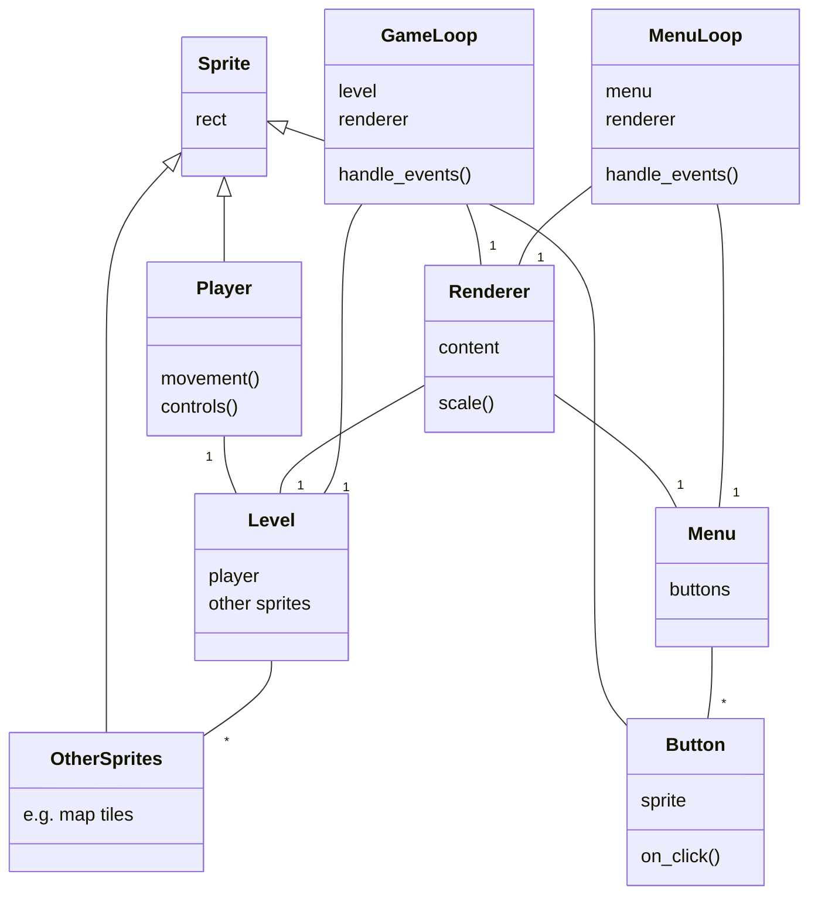

# Architecture description
*This represents the current state of the program and is most likely subject to constant changes*

## The most important classes in a class diagram

### Some notes on the classes
- The loop classes (**GameLoop** , **MenuLoop** )
  - A loop takes either a **level**  or a **menu** and a **renderer** 
  - The loop checks for events and updates the menu / level
- The **Level**  class
  - A level has a player and other sprites such as map tiles
- The **Menu**  class
  - The most important functionality of a menu is to host **buttons** 
- The **Button** class 
  - A button consists of a sprite, text and a reference to a function
  - When the user clicks the button the function gets executed
  - This function can be anything, for example a new loop or an exit call
- The **Renderer** class
  - A renderer takes either a level or a menu as content to render
  - A renderer renders the content to the display and scales it from a small drawing surface to the full-sized display
    - This makes the pixelated look of the game happen
    - Currently the scaling happens in menus too
      - text is pixelated in a less aesthetic way

- The **Sprite** class
  - Currently everything visual in the game inherits from the pygame.sprite.Sprite class
  - Makes especially the rendering easier

