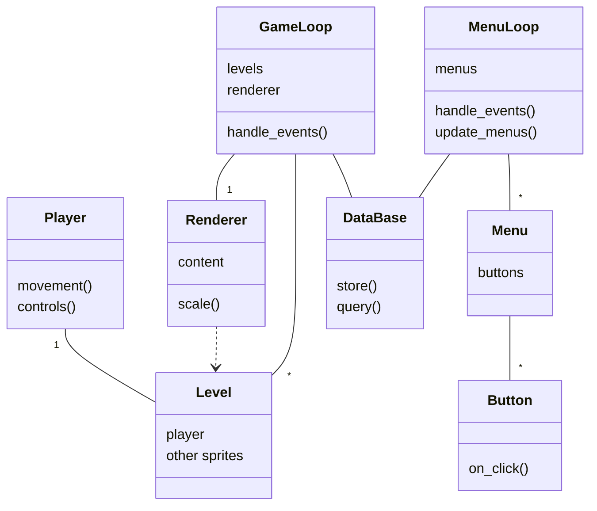
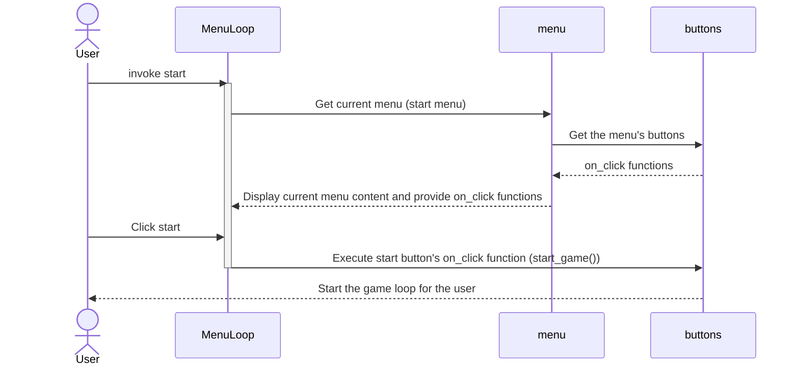

# Architecture description
*This represents the current state of the program and is most likely subject to changes*

## The most important classes and their relationships in a class diagram
This diagram is not exhaustive - instead of depicting every single method and dependency, it focuses on providing an understandable overview

### Some notes on the classes
The loop classes (**GameLoop** , **MenuLoop**)
  - A GameLoop takes a list of levels, a renderer, a clock and a database
    - The loop checks for events, updates the level and stores game result using the database
  - A MenuLoop takes a dict of menus and a database
    - The loop checks for clicks on buttons, handles navigation between menus, updates the menus and queries the database to display its contents

The **DataBase** class
- Every time a game loop ends, the level to which the player got to gets saved
- The database can be queried for the total amount of tries and the highscore (highest level passed)

The **Level**  class
  - A level has a player and other sprites such as map tiles

The **Menu**  class
  - The most important functionality of a menu is to host **buttons** 

The **Button** class 
  - A button consists of text, a rect and a reference to a function
  - When the user clicks the button the function gets executed
  - Any function can be assigned: for example starting a new game, giving an exit call or providing a dict key to navigate to a new menu window are all implemented as on_click functions

The **Renderer** class
  - A renderer takes a level as content to render
  - A renderer renders the content to the display and scales it from a small drawing surface to the full-sized display
    - This makes the pixelated look of the game happen
    - Menus do not have a separate renderer as native resolution is used in the UI

What's a **Sprite** and what's not
  - All in-game stuff is sprites
    - Makes especially the drawing to the screen part easier
  - UI does not utilize sprites
    - Writing text on sprites gets unecessarily complex fast
    - Scaling sprites with text easily leads to unwanted pixelation
    - Using native resolution rects and text instead looks nicer and is easier to scale to any display size

## Sequence diagrams
### Starting the program and starting a new game

