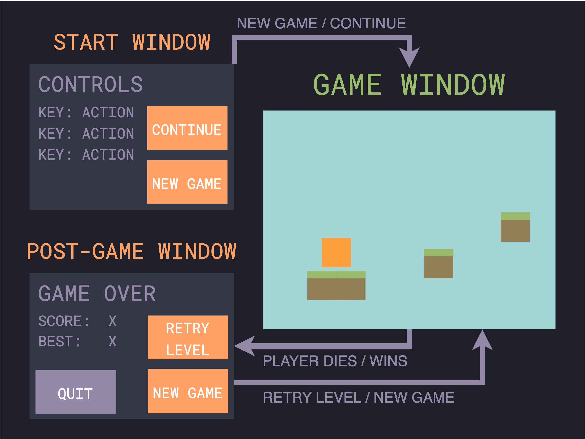

# Requiremets specification
## Purpose of the application
The app I'll be developing on the course is  a simple platformer game. The idea is for the game to be composed of small levels that the player has to pass in order to progress to next levels. In addition to the game itself, the app will also include some menu windows to have a basic UI.

## UI draft
Here's my idea of what components and functionality the UI of the game ought to have (at least):

#### Start window
When first starting the game, the player gets to a start window. Here the player can select to begin a new game. An interesting feature would be to also offer a chance to continue a previous game if one exists.

#### Game window
The game window hosts the game itself. Here the player either maneuvers through the level or falls to hers / his demise.

#### Post-game window
After either dying / finishing the game, the player sees the post-game window. The main function of this window is to give the player a chance to either quit or retry. Some stats could be displayed here too, a highscore for example.

## The base functionality of the application
### The UI
- The most important features from the UI draft above
  - The player can start the game with a new game button in the Start window
  - The post-game window pops up when the player dies or wins
    - A choice to retry or quit (the game doesn't just close when the main game loop finishes)
    - The highscore is displayed

### The Game
- Game levels
  - The game should have at least 2 levels
  - The levels can be passed
  - Once a level is passed, the player advances to the next level
- Player physics and movement
  - Player can move in the game and collide with the game map
  - Player can jump and fall
- A system for scoring game runs
  - For example based on collectibles or playthrough time

### Storing data
- Game results are stored in a database
  - The highscore is conserved even if the game is quit

## Additional ideas for features
### The UI
- A settings window
  - For example to set the resolution
- A level browser
  - If more levels are implemented, a window for choosing them would be nice

### The game
- Game levels
  - More levels
  - Enemies
  - Moving map features
- Player physics and movement
  - Physics could be altered on different levels

### Storing data
- The level to which the player has progressed is saved
  - The game can be continued from the same point where left off
  - Needs more levels to be an useful feature

