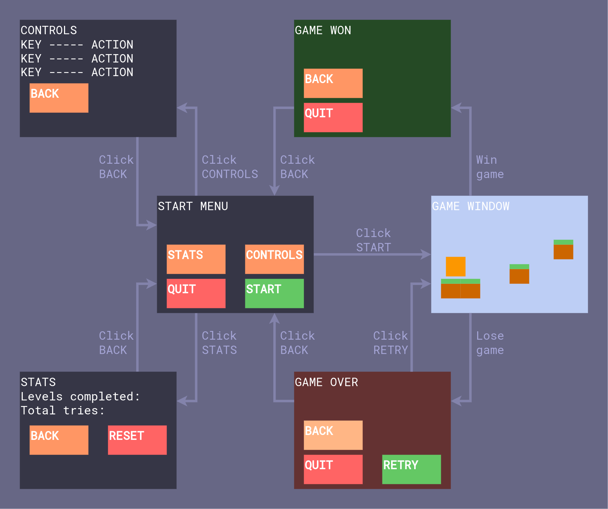

# Requiremets specification
## Purpose of the application
The program is is a simple platformer game. It is developed in python with the pygame library.

The game is composed of small levels that the player has to pass in order to progress to next levels. In addition, the program includes a graphical user interface with menu windows.

## UI
Here are the program's UI features. Below is also a visual overview of what the different windows look like.

### Start window
When first starting the game, the player gets to a start window. Here the player can select to begin a new game, look at the game controls or his/hers gameplay statistics. Quitting the program is possible with the quit button.

### Controls window
Here the user can check out the game controls.

### Stats window
The stats window shows the total amount of tries as well as the highest level passed. Resetting the stats is possible here too.

### Game window
The game window hosts the game itself. Here the user either maneuvers through the level or falls to hers/his demise.

### Post-game windows
After either dying or finishing the game, the user sees the post-game window.

#### Game won
If the user passes all levels, a game won screen is presented. This screen provides buttons to navigate to the start menu or quit the entire program.

#### Game lost
If the player falls and dies, a game lost screen is presented. Here the user can go back to the start menu, retry the game or quit entrirely.

## The functionality of the application
### The UI
- [x] The UI fulfills all features listed above.
- [x] In addition the UI can be extended with new menus and buttons very easily.

### The Game
- Game levels
  - [x] The game has 3 levels
  - [x] The levels can be passed
  - [x] Once a level is passed, the player advances to the next level
  - [x] The game is extensible: adding new levels is effortless
- Player physics and movement
  - [x] Player can move in the game and collide with the game map
  - [x] Player can jump and fall
- A system for scoring game runs
  - [x] highscore based on number of levels passed

### Storing data
- Game results are stored in a database
  - [x] The highscore is conserved even if the game is quit
  - [x] As is the the number of runs
  - [x] Database can be reset from the UI
