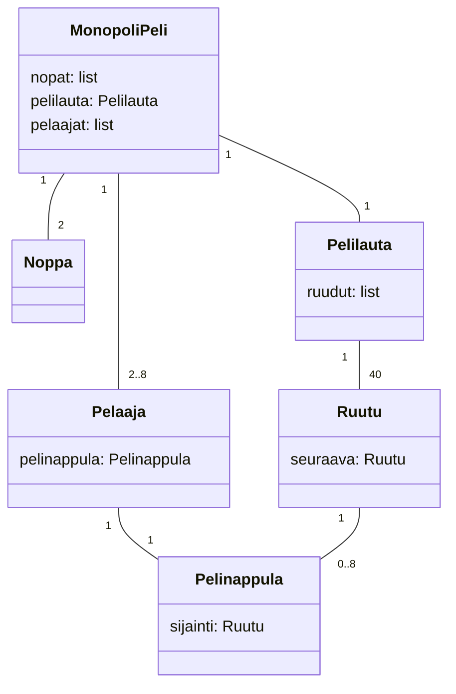
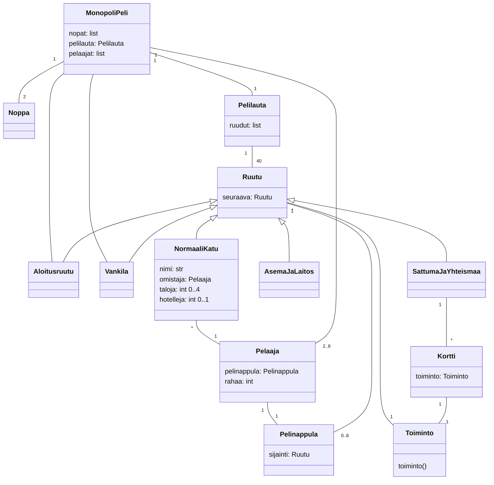

## Tehtävä 1

```mermaid
classDiagram
  class Noppa
  class Pelaaja{
    pelinappula: Pelinappula
  }
  class Pelilauta {
    ruudut: list
  }
  class Ruutu{
    seuraava: Ruutu
  }
  class Pelinappula {
    sijainti: Ruutu
  }
  class MonopoliPeli{
    nopat: list
    pelilauta: Pelilauta
    pelaajat: list
  }
  Pelaaja "1"--"1" Pelinappula
  Ruutu "1"--"0..8" Pelinappula
  Pelilauta "1"--"40" Ruutu
  MonopoliPeli "1"--"2" Noppa
  MonopoliPeli "1"--"2..8" Pelaaja
  MonopoliPeli "1"--"1" Pelilauta
```

## Tehtävä 2

```mermaid
classDiagram
  class Noppa
  class Pelaaja{
    pelinappula: Pelinappula
    rahaa: int
  }
  class Pelilauta {
    ruudut: list
  }
  class Pelinappula {
    sijainti: Ruutu
  }
  class MonopoliPeli{
    nopat: list
    pelilauta: Pelilauta
    pelaajat: list
  }
  class Kortti {
    toiminto: Toiminto
  }
  
  class Ruutu{
    seuraava: Ruutu
  }
  class Aloitusruutu{

  }
  class Vankila{

  }
  class SattumaJaYhteismaa{
  
  }
  class AsemaJaLaitos{

  }
  class NormaaliKatu{
    nimi: str
    omistaja: Pelaaja
    taloja: int 0..4
    hotelleja: int 0..1
  }
  
  class Toiminto{
    toiminto()
  }
  
  Pelaaja "1"--"1" Pelinappula
  Ruutu "1"--"0..8" Pelinappula
  Pelilauta "1"--"40" Ruutu
  Ruutu "*"--"1" Toiminto
  SattumaJaYhteismaa "1"--"*" Kortti
  Kortti "1"--"1" Toiminto
  NormaaliKatu "*"--"1" Pelaaja
  
  MonopoliPeli "1"--"2" Noppa
  MonopoliPeli "1"--"2..8" Pelaaja
  MonopoliPeli "1"--"1" Pelilauta
  MonopoliPeli -- Aloitusruutu
  MonopoliPeli -- Vankila
  
  Ruutu <|-- Aloitusruutu
  Ruutu <|-- Vankila
  Ruutu <|-- SattumaJaYhteismaa
  Ruutu <|-- AsemaJaLaitos
  Ruutu <|-- NormaaliKatu
```
