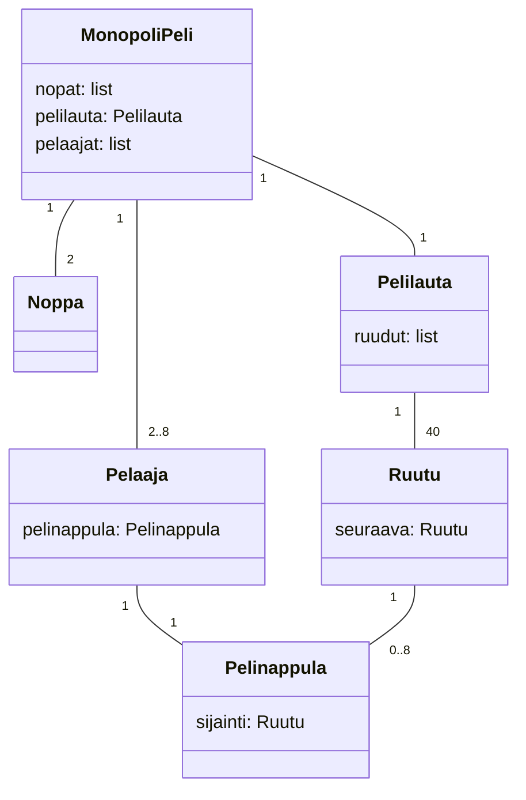

## Tehtävä 1

```mermaid
classDiagram
  class Noppa
  class Pelaaja{
    pelinappula: Pelinappula
  }
  class Pelilauta {
    ruudut: list
  }
  class Ruutu{
    seuraava: Ruutu
  }
  class Pelinappula {
    sijainti: Ruutu
  }
  class MonopoliPeli{
    nopat: list
    pelilauta: Pelilauta
    pelaajat: list
  }
  Pelaaja "1"--"1" Pelinappula
  Ruutu "1"--"0..8" Pelinappula
  Pelilauta "1"--"40" Ruutu
  MonopoliPeli "1"--"2" Noppa
  MonopoliPeli "1"--"2..8" Pelaaja
  MonopoliPeli "1"--"1" Pelilauta
```
