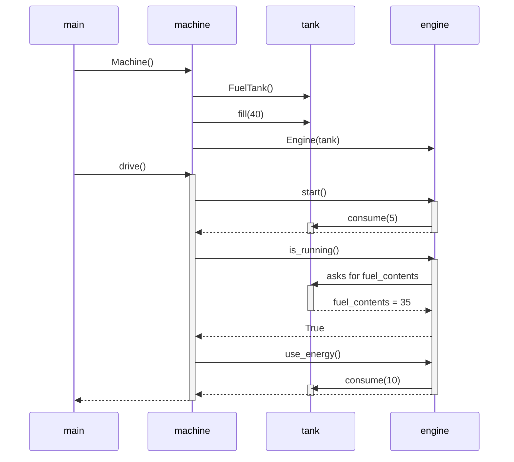

## Tehtävä 3

```mermaid
sequenceDiagram
  main->>machine: Machine()
  
  machine->>tank: FuelTank()
  machine->>tank: fill(40)
  machine->>engine: Engine(tank)
  
  
  main->>machine: drive()
  activate machine
  
  machine->>engine: start()
  activate engine
  engine->>tank: consume(5)
  activate tank
  deactivate tank
  engine-->>machine: 
  deactivate engine
  
  machine->>engine: is_running()
  activate engine
  engine->>tank: asks for fuel_contents
  activate tank
  tank-->>engine: fuel_contents = 35
  deactivate tank
  engine-->>machine: True
  
  machine->>engine: use_energy()
  engine->>tank: consume(10)
  activate tank
  deactivate tank
  engine-->>machine: 
  deactivate engine
  machine-->>main: 
  deactivate machine

```
